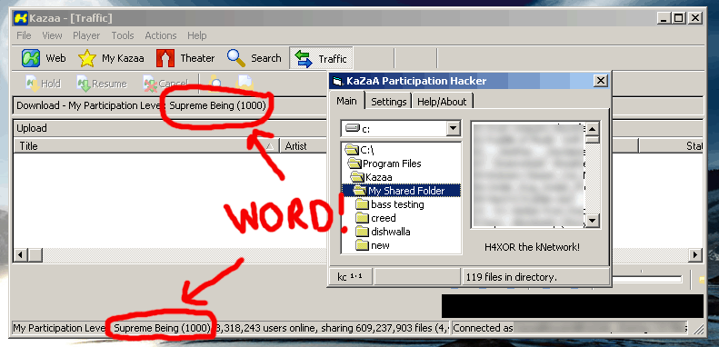



## KaZaA Participation Hack / Cheat

### Description

Tired of that crappy participation rating of yours? Is a Low or Guru rating not good enough?? Then the KaZaA Participation Hack is for you! This program fake transfers files locally so that you too can be a supreme being.

Only works pre KaZaA v2.1 (they fixed this...)

Most people probably still have KaZaA 2.0 though.

Source is fully documented (at least what is mine...) and very easy to understand.
 
### More Info
 

             |
---                |---
**Submitted On**   |2002-11-01 20:04:42
**By**             |[kirse](https://github.com/Planet-Source-Code/PSCIndex/blob/master/ByAuthor/kirse.md)
**Level**          |Intermediate
**User Rating**    |5.0 (50 globes from 10 users)
**Compatibility**  |VB 3\.0, VB 4\.0 \(16\-bit\), VB 4\.0 \(32\-bit\), VB 5\.0, VB 6\.0, VB Script, ASP \(Active Server Pages\) , VBA MS Access, VBA MS Excel
**Category**       |[Miscellaneous](https://github.com/Planet-Source-Code/PSCIndex/blob/master/ByCategory/miscellaneous__1-1.md)
**World**          |[Visual Basic](https://github.com/Planet-Source-Code/PSCIndex/blob/master/ByWorld/visual-basic.md)
**Archive File**   |[KaZaA\_Part1490571112002\.zip](https://github.com/Planet-Source-Code/kirse-kazaa-participation-hack-cheat__1-40332/archive/master.zip)

